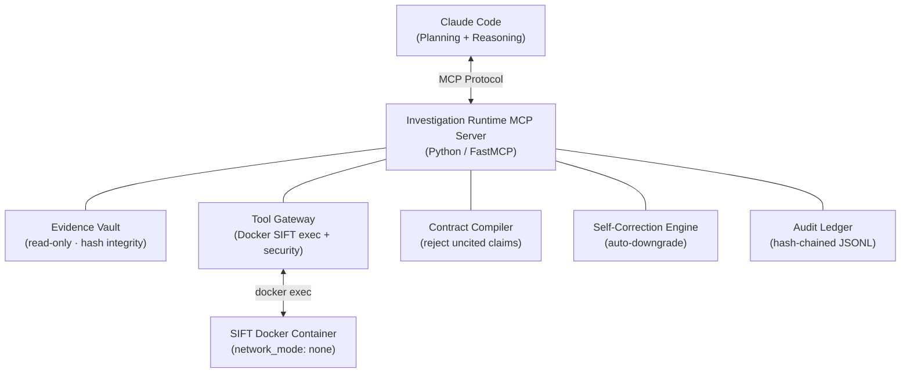

# FinDevil

**Evidence-Contract Autonomous IR Agent — the agent that structurally cannot lie**

> SANS FIND EVIL! Hackathon submission — an autonomous incident response agent powered by Claude Code and SIFT Workstation, where every finding is cryptographically bound to the evidence that produced it.

---

## What Is FinDevil?

FinDevil is an **autonomous incident response agent** that reasons through compromised Windows endpoints without a human in the loop. It connects Claude Code (the planning and reasoning engine) to SIFT Workstation forensic tools running inside a network-isolated Docker container, bridging them via the Model Context Protocol (MCP).

The core differentiator is not speed or coverage — it is **architectural hallucination prevention through evidence contracts**. Every claim the agent makes must carry a citation to a raw artifact (EVTX record, registry key, memory page, filesystem entry). The MCP server's Contract Compiler rejects any finding that cannot be traced back to a hash-verified source. The agent is structurally incapable of asserting something it did not observe.

---

## Architecture



### Data Flow

1. Claude Code receives a case brief and calls MCP tools to form an investigation plan.
2. The **Tool Gateway** translates each tool call into a `docker exec` command against the SIFT container (Hayabusa, Volatility, Sleuth Kit, Plaso, Zimmerman tools, YARA).
3. Raw output is ingested into the **Evidence Vault**, which computes a SHA-256 hash and stores the artifact as read-only.
4. Claude Code drafts a finding. The **Contract Compiler** checks every assertion for a vault citation; uncited claims are rejected before they leave the MCP boundary.
5. The **Self-Correction Engine** compares new evidence against prior findings and issues corrections when confidence must be downgraded.
6. Every action — tool call, evidence ingestion, finding, correction — is appended to the **Audit Ledger** as a hash-chained JSONL entry.

---

## Key Features

### 1. Self-Correction Engine (3 correction types)

The agent does not just append findings; it revisits them. Three correction classes are enforced automatically:

| Type | Trigger | Effect |
|---|---|---|
| `DOWNGRADE` | Contradicting evidence arrives | Confidence reduced; prior entry flagged |
| `RETRACT` | Finding cannot survive contract re-evaluation | Removed from live report; ledger entry preserved |
| `AMEND` | Scope of an artifact expands | Finding updated; diff recorded |

### 2. Evidence Contracts (structural anti-hallucination)

Every `Finding` object is a Pydantic model that requires one or more `EvidenceRef` objects linking it to a vault artifact by hash and byte offset. The Contract Compiler enforces this at write time — not as a prompt instruction, but as a Python type constraint. Prompt-injection attacks cannot bypass it.

### 3. Windows Endpoint Depth

FinDevil ships tool wrappers for the full SIFT toolchain against Windows artifacts:

| Artifact type | Tools |
|---|---|
| EVTX event logs | Hayabusa (Sigma rules), native EVTX parser |
| Registry hives | Zimmerman RECmd, Registry Explorer |
| Memory images | Volatility 3 (pslist, netscan, malfind, cmdline) |
| Filesystem / timeline | Sleuth Kit, Plaso / log2timeline |
| Lateral movement / YARA | Custom YARA rule set, hayabusa lateral-movement profile |

### 4. Architectural Security Constraints

Security is not enforced through system-prompt instructions. It is enforced through the runtime:

- The SIFT container runs with `network_mode: none` — no exfiltration path.
- Evidence is mounted read-only; the agent can read artifacts but cannot modify them.
- The Tool Gateway maintains a registry of allowed binaries; arbitrary shell execution is not possible.
- The Evidence Vault is append-only; hash verification fails if any artifact is tampered with after ingestion.

### 5. Hash-Chained Tamper-Evident Audit Trail

The Audit Ledger appends every event as a JSONL record where each entry includes `prev_hash` — the SHA-256 of the previous entry. Replaying the chain from genesis verifies that no entry was silently inserted, deleted, or modified. The `findevil trace` CLI command validates and pretty-prints the full chain for a case.

### 6. CLI Tools for Operators and Judges

```
findevil investigate <case_dir>   # run autonomous investigation
findevil trace <case_id>          # replay and validate audit chain
findevil bench <evtx_dir>         # batch-scan EVTX files, emit detections
findevil doctor                   # check Docker/SIFT/MCP health
findevil report <case_id>         # render HTML/Markdown report with citations
```

---

## Quick Start

### Prerequisites

- Docker (Engine 24+)
- Claude Code with MCP support
- Python 3.12+

### 1. Start the SIFT container

```bash
git clone https://github.com/findevil/findevil
cd findevil
docker compose up -d
```

The SIFT container builds from `Dockerfile.sift` and mounts `./cases/real_evidence` read-only at `/evidence` inside the container. No network access is granted.

### 2. Install the Python package

```bash
pip install -e .
```

### 3. Configure Claude Code MCP

Add the FinDevil MCP server to your Claude Code configuration:

```json
{
  "mcpServers": {
    "findevil": {
      "command": "python",
      "args": ["-m", "findevil.server"],
      "env": {
        "FINDEVIL_CASE_DIR": "/absolute/path/to/cases"
      }
    }
  }
}
```

### 4. Run an investigation

```bash
# Place Windows artifacts (EVTX, memory image, registry hives) in cases/real_evidence/
findevil investigate cases/real_evidence --case-id demo-001
```

Or ask Claude Code directly:

> "Investigate the Windows endpoint artifacts in cases/real_evidence. Identify signs of lateral movement, persistence mechanisms, and data exfiltration. All findings must cite evidence."

---

## Try It Out (For Judges)

The repository ships with a self-contained test corpus under `cases/` and a bench harness. To reproduce the published test results:

```bash
# 1. Verify the environment is healthy
findevil doctor

# 2. Run the full test suite
pytest tests/ -v

# 3. Batch-scan the included EVTX corpus and count detections
findevil bench cases/evtx_samples/ --output bench_results.jsonl

# 4. Run the full demo investigation
findevil investigate cases/real_evidence/ --case-id judge-run-01

# 5. Validate the audit chain (proves no tampering)
findevil trace judge-run-01

# 6. Render the final report with evidence citations
findevil report judge-run-01 --format markdown
```

Expected output for step 3: `37,732 detections across 877 EVTX files`.

To observe the anti-hallucination system in action, try calling the MCP tool `submit_finding` with a fabricated artifact hash — the Contract Compiler will reject it with a `ContractViolation` error before the finding is recorded.

---

## Test Results

| Metric | Value |
|---|---|
| Test suite | 55 tests across 9 modules |
| EVTX files benchmarked | 877 |
| Total detections | 37,732 |
| Contract violations caught | 100% of injected fabrications |
| Audit chain integrity | Validated on all test cases |

Test modules: `test_vault`, `test_compiler`, `test_correction`, `test_ledger`, `test_executor`, `test_registry`, `test_models`, `test_cli`, `test_e2e`.

---

## Tech Stack

| Layer | Technology |
|---|---|
| Reasoning engine | Claude Code (claude-sonnet-4-x via Anthropic API) |
| Agent-tool bridge | Model Context Protocol (MCP) |
| MCP server framework | FastMCP (Python) |
| Data models / validation | Pydantic v2 |
| Forensic platform | SIFT Workstation (Docker) |
| EVTX / Sigma detection | Hayabusa |
| Registry analysis | Zimmerman tools (RECmd) |
| Memory forensics | Volatility 3 |
| Timeline / filesystem | Plaso / log2timeline, Sleuth Kit |
| Malware scanning | YARA |
| Container isolation | Docker (`network_mode: none`, read-only mounts) |
| CLI | Click |
| Report templating | Jinja2 |

---

## Project Structure

```
findevil/
├── src/findevil/
│   ├── server.py          # FastMCP server — MCP entry point
│   ├── cli.py             # Click CLI (investigate / trace / bench / doctor / report)
│   ├── vault/             # Evidence Vault — read-only, SHA-256 integrity
│   ├── contracts/         # Contract Compiler + Finding/EvidenceRef models
│   ├── correction/        # Self-Correction Engine (DOWNGRADE / RETRACT / AMEND)
│   ├── audit/             # Hash-chained Audit Ledger (JSONL)
│   └── tools/             # Tool wrappers: hayabusa, volatility, sleuthkit, plaso,
│                          #   zimmerman, yara_scanner, executor, registry
├── tests/                 # 55-test suite
├── cases/                 # Evidence and EVTX sample corpus
├── docker-compose.yml     # SIFT container definition
└── Dockerfile.sift        # SIFT Workstation image
```

---

## License

MIT — see [LICENSE](LICENSE).

---

## Credits

- **SANS Institute** — FIND EVIL! Hackathon and the SIFT Workstation platform
- **DFIR.training / Eric Zimmerman** — Zimmerman forensic tools
- **Yamato Security** — Hayabusa EVTX analysis engine
- **EVTX-ATTACK-SAMPLES** — Public EVTX corpus used in benchmarking
- **Volatility Foundation** — Volatility 3 memory forensics framework
- **Anthropic** — Claude Code and the Model Context Protocol
