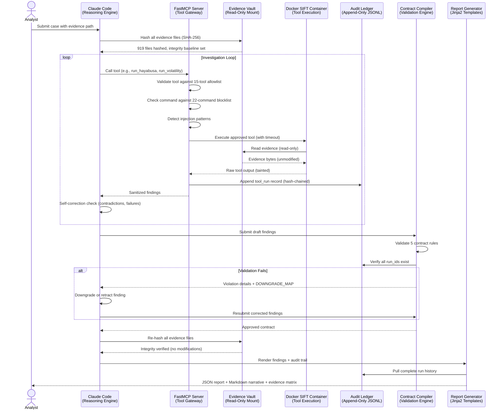

# FinDevil System Architecture

## Overview

FinDevil is a forensic investigation platform that uses Claude as an AI reasoning engine, exposed through a Custom MCP Server. The system coordinates DFIR tooling inside an isolated Docker container, enforces strict evidence integrity, and produces auditable, citation-backed findings reports.

---

## Component Diagram



---

## Component Details

### Evidence Vault

The Evidence Vault is the authoritative, immutable store of all case materials. It is mounted read-only into the Docker SIFT container so no tool execution can alter source evidence.

| Property | Detail |
|----------|--------|
| Mount mode | `ro` (read-only) via Docker volume |
| Integrity check | SHA-256 hash of every file at case initialization |
| Re-verification | Hashes re-checked after all tool executions complete |
| Path boundaries | Strict prefix enforcement — tools cannot traverse outside the case directory |
| Supported formats | EVTX, memory dumps (`.raw`, `.vmem`), prefetch, registry hives, MFT exports, PCAP, log files |

If any file hash changes between initialization and post-run verification, the system raises an `EvidenceTamperError` and aborts report generation.

---

### Tool Gateway (MCP Server)

The FastMCP server acts as the sole interface between Claude and the execution environment. It enforces defense-in-depth before any shell command reaches the container.

**15-Tool Allowlist**

| # | Tool | Purpose |
|---|------|---------|
| 1 | `run_hayabusa` | Sigma-rule-based EVTX triage |
| 2 | `run_volatility` | Memory forensics |
| 3 | `run_plaso` | Super-timeline generation |
| 4 | `run_log2timeline` | Timeline ingestion |
| 5 | `run_strings` | Binary string extraction |
| 6 | `run_yara` | Malware pattern matching |
| 7 | `run_chainsaw` | Fast EVTX hunting |
| 8 | `run_reg_ripper` | Registry artifact extraction |
| 9 | `run_prefetch_parser` | Prefetch execution evidence |
| 10 | `run_mft_parser` | MFT filesystem timeline |
| 11 | `run_lnk_parser` | LNK file analysis |
| 12 | `run_bulk_extractor` | Carved artifact extraction |
| 13 | `read_evidence` | Read a specific evidence file |
| 14 | `list_evidence` | Enumerate available evidence |
| 15 | `get_audit_log` | Retrieve ledger entries |

**22-Command Blocklist**

Prevents destructive or exfiltration commands from reaching the container shell, including: `rm`, `mv`, `cp`, `chmod`, `chown`, `curl`, `wget`, `nc`, `ssh`, `scp`, `rsync`, `dd`, `mkfs`, `mount`, `umount`, `iptables`, `nmap`, `pip install`, `apt`, `yum`, `dnf`, `systemctl`.

**Injection Detection**

All tool arguments are scanned for shell metacharacters (`; | & $ \` ( ) { }`) and null bytes before execution. Any match raises `InjectionAttemptError` and is recorded in the audit ledger.

**Timeout Enforcement**

Each tool invocation has a configurable per-tool timeout (default 300 s). Long-running tools (Plaso, Volatility full scan) have extended limits. Timeout expiry produces a partial result with a `TIMEOUT` status rather than a hard crash.

---

### Contract Compiler

The Contract Compiler validates every finding before it enters the final report. It enforces five rules that prevent hallucinated or weakly supported claims.

| Rule | Description |
|------|-------------|
| **R1 — Multi-source for CONFIRMED** | A finding may only be labeled `CONFIRMED` if at least two independent tools corroborate it. Single-source findings are automatically downgraded to `PROBABLE`. |
| **R2 — No contradictions** | If two tool outputs make logically incompatible claims about the same artifact, the finding is flagged as `CONTRADICTED` and both outputs are preserved in the report for analyst review. |
| **R3 — Valid run_ids** | Every cited `tool_run_id` must exist in the audit ledger. Phantom citations are rejected as `UNVERIFIABLE`. |
| **R4 — Confidence basis for INFERRED** | An `INFERRED` finding must include a documented reasoning chain referencing at least one `tool_run_id` and one observable indicator. |
| **R5 — Evidence required** | No finding may appear in the report without at least one piece of traceable evidence (file path + hash + tool output excerpt). Unsupported assertions are dropped. |

Violations are returned to Claude with structured error messages. Claude applies the `DOWNGRADE_MAP` and resubmits.

---

### Self-Correction Engine

The Self-Correction Engine operates inside Claude's reasoning loop, catching three categories of problems before they reach the Contract Compiler.

**Correction Types**

| Type | Trigger | Action |
|------|---------|--------|
| **Tool Failure** | Tool returns non-zero exit, timeout, or parse error | Retry once with adjusted parameters; record failure; continue without that data point |
| **Contradiction** | Two tool outputs disagree on timestamps, hashes, or event sequences | Explicitly record both findings; set status to `CONTRADICTED`; surface both to analyst |
| **Contract Violation** | Compiler rejects a finding | Apply `DOWNGRADE_MAP`; revise reasoning chain; resubmit |

**DOWNGRADE_MAP**

```
CONFIRMED (single source)  →  PROBABLE
PROBABLE  (no corroboration, weak evidence)  →  POSSIBLE
POSSIBLE  (no direct evidence)  →  INFERRED
INFERRED  (reasoning chain missing)  →  DROPPED
```

---

### Audit Ledger

The Audit Ledger is an append-only JSONL file that records every significant system action. It provides a tamper-evident chain of evidence for the entire investigation.

| Property | Detail |
|----------|--------|
| Format | Newline-delimited JSON (`.jsonl`) |
| Location | `workspace/<case_id>/audit.jsonl` |
| Hash chaining | Each record includes the SHA-256 of the previous record |
| Entry types | `CASE_INIT`, `TOOL_CALL`, `TOOL_RESULT`, `CORRECTION`, `COMPILER_VIOLATION`, `COMPILER_APPROVED`, `REPORT_GENERATED` |
| Tamper detection | On load, the chain is re-verified; any break raises `LedgerTamperError` |
| Immutability | File opened in append mode only; no record deletion or modification permitted |

A sample ledger entry:

```json
{
  "seq": 42,
  "ts": "2025-06-08T14:23:01.337Z",
  "type": "TOOL_RESULT",
  "tool": "run_hayabusa",
  "run_id": "hr-0042",
  "exit_code": 0,
  "finding_count": 17,
  "prev_hash": "a3f9c2...",
  "self_hash": "8b1d47..."
}
```

---

### Report Generator

The Report Generator transforms validated findings and the audit ledger into deliverables for the analyst.

| Property | Detail |
|----------|--------|
| Template engine | Jinja2 |
| Output formats | JSON (machine-readable) + Markdown (human narrative) |
| Evidence coverage matrix | Lists every evidence file, which tools processed it, and which findings cite it |
| Confidence distribution | Breakdown of CONFIRMED / PROBABLE / POSSIBLE / INFERRED counts |
| Audit summary | Total tool calls, corrections applied, compiler violations, final hash chain status |
| MITRE ATT&CK mapping | Each finding tagged with relevant tactic/technique where Sigma rules provide mappings |

---

## Security Boundaries

| Boundary | Mechanism |
|----------|-----------|
| Evidence immutability | Docker read-only volume mount (`ro`) + SHA-256 pre/post verification |
| Network isolation | Container launched with `--network none`; no outbound connectivity |
| Command injection | Argument scanning for shell metacharacters before any `subprocess` call |
| Path traversal | All evidence paths validated against the case root prefix before opening |
| Tool output trust | All tool output treated as tainted; parsed into structured types before Claude sees it |
| Audit integrity | Hash-chained ledger; any tampering detected on load |

---

## Architectural Pattern

This project implements the **Custom MCP Server** pattern from the hackathon guidelines. Claude Code connects to a locally running FastMCP server that exposes forensic tools as typed MCP tools. The MCP server owns all execution policy (allowlists, blocklists, timeouts, injection checks) and is the only process that communicates with the Docker SIFT container. Claude never issues shell commands directly.

```
Claude Code  ──MCP protocol──>  FastMCP Server  ──subprocess──>  Docker SIFT Container
                                      |
                                 Audit Ledger
```

This separation ensures that even if Claude's reasoning produces a malicious tool call, the MCP server's policy layer prevents it from executing.
